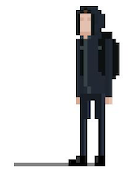

#  Base PHP Docker Image


# About

Repository has Dockerfiles with pre-installed PHP extensions:

* pdo_mysql
* pdo_pgsql
* gd

[Docker Images at Docker Hub](https://hub.docker.com/repository/docker/noitran/php-base/tags?page=1)

## Usage

### Local Build

```bash
$ git clone git@github.com:noitran/docker-php-base.git
$ make build
```

### Testing image

```bash
$ make test
```

### Pushing to Docker Hub

```bash
$ make doker-push
```

## Useful Links

Resources used:

* [Run your GitHub Actions workflow on a schedule - Jason Etcovitch · jasonet.co](https://jasonet.co/posts/scheduled-actions/)

* [Templating your Dockerfile like a boss! \| by Ahmed ElGamil | Dockbit](https://blog.dockbit.com/templating-your-dockerfile-like-a-boss-2a84a67d28e9)

* [Workflow syntax for GitHub Actions - GitHub Docs](https://docs.github.com/en/actions/reference/workflow-syntax-for-github-actions)

* [Support saving environment variables between steps - GitHub Actions - GitHub Support Community](https://github.community/t/support-saving-environment-variables-between-steps/16230/6)
